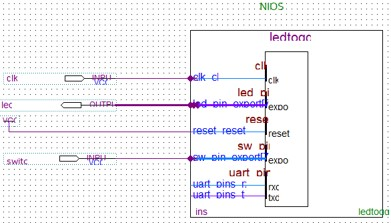
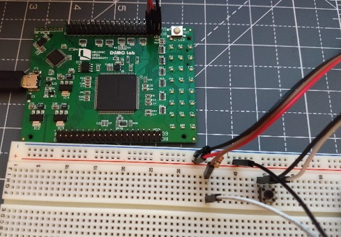

# LedToggle

An example for NIOS II processor to toggle a Led with a Button

## Information

This is a VHDL project for DSD-I1* a Cyclone IV FPGA built in Quartus 18.1 to design a NIOS II processor block and execute C code to toggle Led with the push of a Button. You can change the predefined pins assigned to Led (PIN_110) and Button (PIN_51) using the Pin Planner.

**Diagram**:  

**FPGA**:  

*Note: DSD-i1: A Mixed Functionality Development Board Geared Towards Digital Systems Design Education [DOI:10.1109/DSD.2019.00032](https://ieeexplore.ieee.org/document/8875176)

## Licence

Copyright (c) 2019 Stavros Kalapothas (aka Stevaras) <stavros@ubinet.gr>.
It is free software, and may be redistributed under the terms of the GNU Licence.